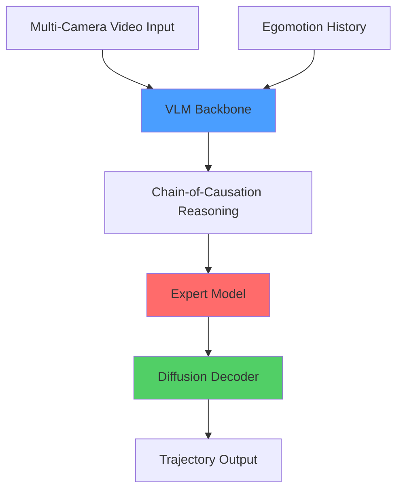

Alpamayo 1 implements a novel Vision-Language-Action (VLA) architecture that bridges reasoning and action prediction for autonomous driving. The model combines a vision-language backbone with an expert action prediction module through a diffusion-based framework.

## Architecture Components

The Alpamayo 1 architecture consists of four primary components working in concert:



### 1. Vision-Language-Action Backbone (VLM)

The foundation of Alpamayo 1 is built on the **Qwen3-VL architecture**, a state-of-the-art vision-language model:

- **Model**: Qwen3-VL-8B-Instruct (10B parameters total)
- **Implementation**: `Qwen3VLForConditionalGeneration` from HuggingFace Transformers
- **Purpose**: Processes multi-camera video streams and generates Chain-of-Causation reasoning traces

```python
# From alpamayo_r1/models/base_model.py:366-381
def _initialize_qwenvl3_vlm(self, config: ReasoningVLAConfig) -> None:
    """Initialize Qwen3-VL VLM backbone."""
    vlm_config = Qwen3VLConfig.from_pretrained(
        config.vlm_name_or_path,
        dtype=config.model_dtype,
        attn_implementation=config.attn_implementation,
    )
    self.original_vocab_size = vlm_config.text_config.vocab_size
    vlm_config.text_config.vocab_size = config.vocab_size
    vlm_config.vocab_size = config.vocab_size
    self.vlm = Qwen3VLForConditionalGeneration(vlm_config)
```

The VLM backbone is extended with **trajectory tokens** added to the vocabulary:

- **Discrete trajectory tokens**: 768 tokens (`<i0>` through `<i767>`)
- **Special tokens**: `<|traj_history_start|>`, `<|traj_future_start|>`, `<|cot_start|>`, etc.
- **Total vocabulary**: Original vocab + 768 discrete tokens + special tokens

### 2. Expert Model

The expert model is a specialized decoder that processes the VLM's output to predict actions:

```python
# From alpamayo_r1/models/alpamayo_r1.py:86-94
# Text config from VLM is reused for the expert
expert_config = copy.deepcopy(self.vlm.config.text_config)
if config.expert_cfg is not None:
    for key, value in config.expert_cfg.items():
        setattr(expert_config, key, value)
self.expert = AutoModel.from_config(expert_config)
# Embedding tokens are shared with VLM
del self.expert.embed_tokens
```

**Key characteristics**:
- Shares text architecture configuration with the VLM
- Uses **non-causal attention** by default (`expert_non_causal_attention=True`)
- Reuses the VLM's KV cache for efficient inference
- No separate embedding layer (embeddings come from action projection)

### 3. Action Space

Alpamayo 1 uses a **Unicycle Kinematic Model** with acceleration and curvature as control inputs:

```python
# From alpamayo_r1/action_space/unicycle_accel_curvature.py:98-100
def get_action_space_dims(self) -> tuple[int, int]:
    """Get the dimensions of the action space."""
    return (self.n_waypoints, 2)
```

**Action representation**:
- **Dimensions**: `(64, 2)` - 64 waypoints, 2 controls per waypoint
- **Controls**: `[acceleration, curvature]` at each waypoint
- **Temporal resolution**: 10 Hz (0.1s intervals via `dt=0.1`)
- **Prediction horizon**: 6.4 seconds (64 waypoints × 0.1s)

**Action-to-trajectory conversion**:
```python
# From alpamayo_r1/action_space/unicycle_accel_curvature.py:300-382
def action_to_traj(
    self,
    action: torch.Tensor,
    traj_history_xyz: torch.Tensor,
    traj_history_rot: torch.Tensor,
    t0_states: dict[str, torch.Tensor] | None = None,
) -> tuple[torch.Tensor, torch.Tensor]:
    """Transform the action space to the trajectory.
    
    Uses kinematic integration:
    - velocity[t+1] = velocity[t] + acceleration * dt
    - theta[t+1] = theta[t] + curvature * velocity * dt
    - x[t+1] = x[t] + velocity * cos(theta) * dt
    - y[t+1] = y[t] + velocity * sin(theta) * dt
    """
```

### 4. Diffusion Decoder

Alpamayo 1 employs **Flow Matching**, a continuous normalizing flow approach for trajectory generation:

```python
# From alpamayo_r1/diffusion/flow_matching.py:22-30
class FlowMatching(BaseDiffusion):
    """Flow Matching model.
    
    References:
    Flow Matching for Generative Modeling
        https://arxiv.org/pdf/2210.02747
    Guided Flows for Generative Modeling and Decision Making
        https://arxiv.org/pdf/2311.13443
    """
```

**Diffusion parameters**:
- **Integration method**: Euler integration
- **Inference steps**: 10 steps (configurable)
- **Input**: Random Gaussian noise → Output: Trajectory actions
- **Denoising**: Expert model predicts velocity field at each timestep

<Tip>
  Flow Matching learns continuous flows from noise to data, enabling faster sampling than traditional diffusion models while maintaining generation quality.
</Tip>

## Information Flow

The complete inference pipeline follows this sequence:

### Phase 1: VLM Processing

1. **Input tokenization**: Multi-camera images + egomotion history → token sequence
2. **History trajectory fusion**: Discrete trajectory tokens inserted into input
3. **Autoregressive generation**: VLM generates Chain-of-Causation text
4. **KV cache extraction**: Store attention cache for expert model

```python
# From alpamayo_r1/models/alpamayo_r1.py:192-198
vlm_outputs = self.vlm.generate(
    input_ids=input_ids,
    generation_config=generation_config,
    stopping_criteria=stopping_criteria,
    logits_processor=logits_processor,
    **tokenized_data,
)
```

### Phase 2: Expert Processing & Diffusion

1. **Diffusion initialization**: Sample random noise `x ~ N(0, I)` in action space
2. **Iterative denoising** (10 steps):
   - Project noisy action → token embeddings via `action_in_proj`
   - Run expert model with cached VLM context
   - Predict velocity field via `action_out_proj`
   - Update action: `x = x + dt * velocity_field`
3. **Action-to-trajectory conversion**: Map final actions → XYZ positions + rotations

```python
# From alpamayo_r1/models/alpamayo_r1.py:254-284
def step_fn(x: torch.Tensor, t: torch.Tensor) -> torch.Tensor:
    # Project noisy action to expert token embeddings
    future_token_embeds = self.action_in_proj(x, t)
    
    # Run expert with cached prefill, only on future tokens
    expert_out_base = self.expert(
        inputs_embeds=future_token_embeds,
        position_ids=position_ids,
        past_key_values=prompt_cache,
        attention_mask=attention_mask,
        use_cache=True,
        **forward_kwargs,
    )
    # ... predict velocity field
```

### Phase 3: Output Generation

**Outputs** (per input sample):
- **Trajectories**: `(num_traj_samples, 64, 3)` - XYZ waypoints at 10 Hz
- **Rotations**: `(num_traj_samples, 64, 3, 3)` - SO(3) rotation matrices
- **Chain-of-Causation**: Text reasoning trace explaining the prediction

## Model Configuration

Key configuration parameters from `AlpamayoR1Config`:

| Parameter | Default | Description |
|-----------|---------|-------------|
| `vlm_name_or_path` | `"Qwen/Qwen3-VL-8B-Instruct"` | Vision-language backbone |
| `traj_vocab_size` | `768` | Number of discrete trajectory tokens |
| `tokens_per_history_traj` | `16` | Tokens encoding egomotion history |
| `tokens_per_future_traj` | `64` | Tokens for future trajectory |
| `model_dtype` | `"bfloat16"` | Model precision |
| `attn_implementation` | `"flash_attention_2"` | Attention mechanism |
| `expert_non_causal_attention` | `True` | Expert uses bidirectional attention |
| `keep_same_dtype` | `True` | Diffusion/action modules match expert dtype |

## Memory & Compute Requirements

<Warning>
  Alpamayo 1 requires at least **24 GB VRAM** for inference. Tested on RTX 3090, RTX 4090, A5000, and H100 GPUs.
</Warning>

**Model footprint**:
- VLM backbone: ~8B parameters
- Expert model: ~2B parameters  
- Action projections + diffusion: &lt;100M parameters
- **Total**: ~10B parameters

**Inference optimizations**:
- Flash Attention 2 for efficient attention computation
- KV cache reuse between VLM and expert
- bfloat16 precision to reduce memory usage

## Next Steps

<CardGroup cols={2}>
  <Card title="Chain-of-Causation" icon="brain" href="/concepts/chain-of-causation">
    Learn how Alpamayo 1 generates reasoning traces
  </Card>
  <Card title="Trajectory Prediction" icon="route" href="/concepts/trajectory-prediction">
    Understand trajectory generation and diffusion sampling
  </Card>
  <Card title="Inputs & Outputs" icon="arrow-right-arrow-left" href="/concepts/inputs-outputs">
    Detailed specifications for model I/O
  </Card>
</CardGroup>