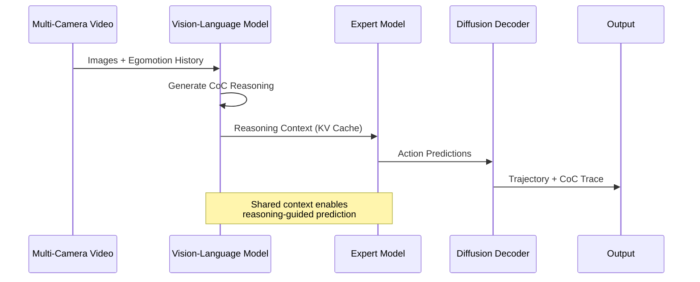

Chain-of-Causation (CoC) is Alpamayo 1's approach to generating interpretable, step-by-step reasoning traces that explain **why** the model predicts a particular trajectory. Unlike black-box motion prediction models, Alpamayo 1 produces human-readable explanations alongside its driving outputs.

## What is Chain-of-Causation?

Chain-of-Causation reasoning generates natural language descriptions that:

1. **Identify relevant scene elements** (pedestrians, vehicles, traffic signals, etc.)
2. **Analyze their causal relationships** to ego vehicle behavior
3. **Explain the predicted trajectory** in terms of those relationships

<Note>
  CoC traces are generated **before** trajectory prediction, allowing the reasoning to guide the expert model's action predictions through shared context.
</Note>

### Example Chain-of-Causation

```text
There is a pedestrian crossing the street ahead on the right side.
The traffic light is red, requiring the ego vehicle to stop.
The vehicle in the left lane is slowing down, indicating traffic congestion.
The ego vehicle should decelerate smoothly and come to a complete stop 
before the crosswalk to yield to the pedestrian and obey the traffic signal.
```

This reasoning trace explains **what** the model observes and **why** it predicts a stopping trajectory.

## Architecture Integration

CoC reasoning is deeply integrated into Alpamayo 1's two-stage architecture:



### Stage 1: VLM Reasoning Generation

The Vision-Language Model generates CoC traces through autoregressive text generation:

```python
# From alpamayo_r1/models/alpamayo_r1.py:169-198
generation_config.top_p = top_p
generation_config.temperature = temperature
generation_config.do_sample = True
generation_config.max_new_tokens = max_generation_length

# Use custom stopping criteria to stop after special token
eos_token_id = self.tokenizer.convert_tokens_to_ids(
    to_special_token("traj_future_start")
)
stopping_criteria = StoppingCriteriaList([
    StopAfterEOS(eos_token_id=eos_token_id)
])

# Mask out trajectory tokens during reasoning generation
logits_processor = LogitsProcessorList([
    ExpertLogitsProcessor(
        traj_token_offset=self.config.traj_token_start_idx,
        traj_vocab_size=self.config.traj_vocab_size,
    )
])

vlm_outputs = self.vlm.generate(
    input_ids=input_ids,
    generation_config=generation_config,
    stopping_criteria=stopping_criteria,
    logits_processor=logits_processor,
    **tokenized_data,
)
```

**Key generation details**:
- **Sampling strategy**: Nucleus sampling (top-p) with temperature scaling
- **Default parameters**: `top_p=0.98`, `temperature=0.6`
- **Stop condition**: Generation stops at `<|traj_future_start|>` token
- **Masking**: Discrete trajectory tokens are masked out (set to `-inf`) during CoC generation

### Stage 2: Expert Model Uses CoC Context

The expert model reuses the VLM's KV (key-value) cache, which contains the encoded CoC reasoning:

```python
# From alpamayo_r1/models/alpamayo_r1.py:207-248
prompt_cache = vlm_outputs.past_key_values
prefill_seq_len = prompt_cache.get_seq_length()

# Expert processes action tokens with CoC context
expert_out_base = self.expert(
    inputs_embeds=future_token_embeds,
    position_ids=position_ids,
    past_key_values=prompt_cache,  # CoC reasoning context
    attention_mask=attention_mask,
    use_cache=True,
    **forward_kwargs,
)
```

This **context sharing** ensures that trajectory predictions are informed by the reasoning trace.

## Special Tokens for Structure

Alpamayo 1 uses special tokens to delineate different parts of the output:

```python
# From alpamayo_r1/models/base_model.py:36-74
TRAJ_TOKEN = {
    "history": "<|traj_history|>",
    "future": "<|traj_future|>",
    "history_start": "<|traj_history_start|>",
    "future_start": "<|traj_future_start|>",
    "history_end": "<|traj_history_end|>",
    "future_end": "<|traj_future_end|>",
}

SPECIAL_TOKENS_KEYS = [
    "prompt_start",
    "prompt_end",
    "image_start",
    "image_pre_tkn",
    "image_end",
    "traj_history_start",
    "traj_history_pre_tkn",
    "traj_history_end",
    "cot_start",              # Chain-of-Thought/Causation start
    "cot_end",                # Chain-of-Thought/Causation end
    # ...
]
```

### Typical Token Sequence

```
<|image_start|> [image tokens] <|image_end|>
<|traj_history_start|> [trajectory history tokens] <|traj_history_end|>
<|cot_start|> [Chain-of-Causation text] <|cot_end|>
<|traj_future_start|> [trajectory tokens generated by expert]
```

## Training Data & Supervision

From the README (lines 89-92):

| Feature | Paper Description | Release (v1.0) |
|---------|-------------------|----------------|
| **Chain-of-Causation (CoC) reasoning** | Hybrid auto-labeling with human in the loop for reasoning traces | ✅ Included |

CoC reasoning traces in the training data were created through:
- **Auto-labeling**: Automated generation of reasoning candidates
- **Human-in-the-loop**: Human reviewers validate and refine reasoning quality
- **Supervision**: Model is trained to generate these traces via standard language modeling loss

<Tip>
  The current release focuses on supervised learning. The paper also describes RL post-training for improving reasoning quality, but this is not included in the v1.0 release.
</Tip>

## Extracting CoC from Model Outputs

When running inference with `return_extra=True`, CoC traces are returned separately:

```python
# From alpamayo_r1/test_inference.py:56-66
with torch.autocast("cuda", dtype=torch.bfloat16):
    pred_xyz, pred_rot, extra = model.sample_trajectories_from_data_with_vlm_rollout(
        data=model_inputs,
        top_p=0.98,
        temperature=0.6,
        num_traj_samples=1,
        max_generation_length=256,
        return_extra=True,  # Returns CoC traces
    )

print("Chain-of-Causation (per trajectory):\n", extra["cot"][0])
```

**Output structure**:
```python
extra = {
    "cot": np.ndarray,  # Shape: [batch_size, num_traj_sets, num_traj_samples]
    # Each element is a string containing the CoC reasoning trace
}
```

<Info>
  **Multi-sample generation**: When `num_traj_samples > 1`, each sample gets its own CoC trace due to stochastic sampling, providing diverse reasoning explanations.
</Info>

## Reasoning Quality & Limitations

### Strengths

- **Interpretability**: Human-readable explanations of driving decisions
- **Scene understanding**: Demonstrates awareness of relevant objects and their states
- **Causal relationships**: Links observations to predicted actions
- **Multi-modal grounding**: Reasoning is grounded in visual observations

### Current Limitations

<Warning>
  The v1.0 release does **not** include:
  - **RL post-training** for reasoning quality improvement
  - **Meta-actions** or high-level behavior descriptions
  - **General VQA** (visual question answering) capabilities
  - **Route conditioning** or navigation-aware reasoning
</Warning>

From README FAQ (lines 117-120):
> While the paper describes RL stages for improving reasoning quality and action consistency, this release focuses on the supervised learning components. We may release RL post-trained models in future releases.

## Customizing Reasoning Generation

You can control CoC generation through sampling parameters:

```python
pred_xyz, pred_rot, extra = model.sample_trajectories_from_data_with_vlm_rollout(
    data=model_inputs,
    
    # Nucleus sampling - controls diversity
    top_p=0.98,        # Keep tokens with cumulative prob 98%
    
    # Temperature - controls randomness
    temperature=0.6,   # Lower = more deterministic, Higher = more creative
    
    # Top-k sampling (optional)
    top_k=50,          # Consider only top-k tokens (None = disabled)
    
    # Maximum reasoning length
    max_generation_length=256,  # Tokens allocated for CoC + special tokens
    
    return_extra=True,
)
```

**Tuning guidelines**:
- **Lower temperature** (0.3-0.5): More focused, deterministic reasoning
- **Higher temperature** (0.7-1.0): More diverse, creative explanations
- **top_p closer to 1.0**: Include more token candidates (more diverse)
- **top_p closer to 0.0**: Restrict to highest-probability tokens (more deterministic)

## Research Applications

Chain-of-Causation reasoning enables several research directions:

1. **Interpretability studies**: Analyze what scene elements the model attends to
2. **Failure analysis**: Understand why the model makes mistakes
3. **Trust & safety**: Verify that predictions are based on appropriate reasoning
4. **Data augmentation**: Use reasoning traces for auto-labeling new data
5. **Human-AI collaboration**: Enable human oversight of autonomous systems

<CardGroup cols={2}>
  <Card title="Architecture Overview" icon="sitemap" href="/concepts/architecture">
    Understand how CoC fits into the overall architecture
  </Card>
  <Card title="Inputs & Outputs" icon="arrow-right-arrow-left" href="/concepts/inputs-outputs">
    Detailed format of CoC outputs
  </Card>
</CardGroup>