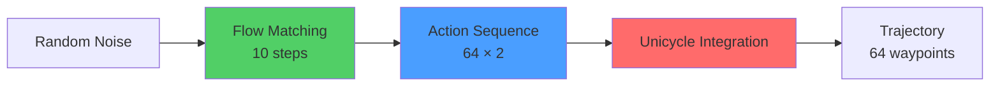

Alpamayo 1 predicts future vehicle trajectories by combining an **action space representation** with a **diffusion-based decoder**. This approach enables probabilistic trajectory generation that captures the multimodal nature of autonomous driving scenarios.

## Overview

Trajectory prediction in Alpamayo 1 follows a three-stage process:

1. **Action parameterization**: Represent trajectories as sequences of acceleration and curvature controls
2. **Diffusion sampling**: Generate action sequences using flow matching diffusion
3. **Kinematic integration**: Convert actions to XYZ waypoints using a unicycle motion model



## Action Space Representation

Alpamayo 1 uses a **Unicycle Kinematic Model** with acceleration and curvature as control inputs, implemented in `UnicycleAccelCurvatureActionSpace`.

### Action Dimensions

```python
# From alpamayo_r1/action_space/unicycle_accel_curvature.py:98-100
def get_action_space_dims(self) -> tuple[int, int]:
    """Get the dimensions of the action space."""
    return (self.n_waypoints, 2)
```

**Parameters**:
- **Number of waypoints**: 64
- **Controls per waypoint**: 2 (acceleration, curvature)
- **Total action dimensions**: `(64, 2)`
- **Temporal resolution**: 10 Hz (`dt = 0.1` seconds)
- **Prediction horizon**: 6.4 seconds

### Control Variables

Each waypoint is parameterized by two control inputs:

| Control | Description | Units | Bounds | Normalization |
|---------|-------------|-------|--------|--------------|
| **Acceleration** (`a`) | Longitudinal acceleration | m/s² | [-9.8, 9.8] | Mean=0.0, Std=1.0 |
| **Curvature** (`κ`) | Path curvature (1/radius) | m⁻¹ | [-0.2, 0.2] | Mean=0.0, Std=1.0 |

<Info>
  **Curvature** represents how sharply the vehicle turns. A curvature of 0.2 m⁻¹ corresponds to a turning radius of 5 meters (tight turn), while 0.01 m⁻¹ corresponds to 100 meters (gentle curve).
</Info>

```python
# From alpamayo_r1/action_space/unicycle_accel_curvature.py:39-96
class UnicycleAccelCurvatureActionSpace(ActionSpace):
    def __init__(
        self,
        accel_mean: float = 0.0,
        accel_std: float = 1.0,
        curvature_mean: float = 0.0,
        curvature_std: float = 1.0,
        accel_bounds: tuple[float, float] = (-9.8, 9.8),
        curvature_bounds: tuple[float, float] = (-0.2, 0.2),
        dt: float = 0.1,
        n_waypoints: int = 64,
        # Smoothness regularization parameters
        theta_lambda: float = 1e-6,
        v_lambda: float = 1e-6,
        a_lambda: float = 1e-4,
        kappa_lambda: float = 1e-4,
        # ...
    ):
```

## Kinematic Motion Model

The unicycle model converts control sequences into spatial trajectories through forward integration.

### State Variables

At each timestep `t`, the vehicle state consists of:
- **Position**: `(x_t, y_t)` in meters
- **Heading**: `θ_t` in radians
- **Velocity**: `v_t` in m/s

### Integration Equations

```python
# From alpamayo_r1/action_space/unicycle_accel_curvature.py:331-380
# Velocity integration
velocity[t+1] = velocity[t] + acceleration[t] * dt

# Heading integration
theta[t+1] = theta[t] + curvature[t] * velocity[t] * dt + \
                        curvature[t] * acceleration[t] * (dt^2 / 2)

# Position integration (trapezoidal rule)
x[t+1] = x[t] + (velocity[t] * cos(theta[t]) + 
                  velocity[t+1] * cos(theta[t+1])) * dt / 2
                  
y[t+1] = y[t] + (velocity[t] * sin(theta[t]) + 
                  velocity[t+1] * sin(theta[t+1])) * dt / 2
```

### Initial State Estimation

The model estimates the initial velocity `v_0` from egomotion history:

```python
# From alpamayo_r1/action_space/unicycle_accel_curvature.py:208-222
def estimate_t0_states(
    self, traj_history_xyz: torch.Tensor, traj_history_rot: torch.Tensor
) -> dict[str, torch.Tensor]:
    """Estimate the t0 states from the trajectory history."""
    full_xy = traj_history_xyz[..., :2]  # (..., N_hist, 2)
    dxy = full_xy[..., 1:, :] - full_xy[..., :-1, :]  # (..., N_hist-1, 2)
    theta = so3_to_yaw_torch(traj_history_rot)
    theta = unwrap_angle(theta)
    
    v = dxy_theta_to_v_without_v0(
        dxy=dxy, theta=theta, dt=self.dt, 
        v_lambda=self.v_lambda, v_ridge=self.v_ridge
    )  # (..., N+1)
    v_t0 = v[..., -1]
    return {"v": v_t0}
```

<Tip>
  Initial velocity estimation uses Tikhonov regularization to ensure smooth velocity profiles consistent with the observed position changes.
</Tip>

## Diffusion-Based Generation

Alpamayo 1 uses **Flow Matching**, a continuous normalizing flow technique, to generate action sequences.

### Flow Matching Basics

Flow matching learns a velocity field `v(x, t)` that transforms:
- **Source distribution** (t=0): Standard Gaussian noise `x ~ N(0, I)`
- **Target distribution** (t=1): Valid driving action sequences

```python
# From alpamayo_r1/diffusion/flow_matching.py:22-47
class FlowMatching(BaseDiffusion):
    """Flow Matching model.
    
    References:
    Flow Matching for Generative Modeling
        https://arxiv.org/pdf/2210.02747
    Guided Flows for Generative Modeling and Decision Making
        https://arxiv.org/pdf/2311.13443
    """
    
    def __init__(
        self,
        int_method: Literal["euler"] = "euler",
        num_inference_steps: int = 10,
        *args,
        **kwargs,
    ):
```

### Sampling Process

The diffusion decoder performs iterative denoising:

```python
# From alpamayo_r1/diffusion/flow_matching.py:111-127
# Initialize with random noise
x = torch.randn(batch_size, *self.x_dims, device=device)
time_steps = torch.linspace(0.0, 1.0, inference_step + 1, device=device)

# Euler integration over timesteps
for i in range(inference_step):
    dt = time_steps[i + 1] - time_steps[i]
    t_start = time_steps[i]
    
    # Predict velocity field
    v = step_fn(x=x, t=t_start)
    
    # Update action
    x = x + dt * v
```

**Default parameters**:
- **Integration method**: Euler (first-order ODE solver)
- **Number of steps**: 10
- **Timestep schedule**: Linear from 0 to 1

### Expert Model as Denoiser

The expert model predicts the velocity field at each diffusion timestep:

```python
# From alpamayo_r1/models/alpamayo_r1.py:254-284
def step_fn(x: torch.Tensor, t: torch.Tensor) -> torch.Tensor:
    # x: (B*, 64, 2) - current noisy action
    # t: (B*, 1, 1) - diffusion timestep [0, 1]
    
    b_star = x.shape[0]
    n_diffusion_tokens = self.action_space.get_action_space_dims()[0]  # 64
    
    # Project noisy action to expert token embeddings
    future_token_embeds = self.action_in_proj(x, t)
    # Shape: (b*, 64, hidden_size)
    
    # Run expert with cached CoC context
    expert_out_base = self.expert(
        inputs_embeds=future_token_embeds,
        position_ids=position_ids,
        past_key_values=prompt_cache,  # Cached VLM outputs
        attention_mask=attention_mask,
        use_cache=True,
        **forward_kwargs,
    )
    
    # Project to velocity field
    last_hidden = expert_out_base.last_hidden_state[:, -n_diffusion_tokens:]
    pred = self.action_out_proj(last_hidden).view(
        -1, *self.action_space.get_action_space_dims()
    )  # (b*, 64, 2) - velocity field
    
    return pred
```

**Key components**:
1. **Action input projection** (`action_in_proj`): Maps `(action, timestep)` → token embeddings
2. **Expert transformer**: Processes embeddings with CoC reasoning context
3. **Action output projection** (`action_out_proj`): Maps hidden states → velocity field

<Warning>
  The expert model uses **non-causal attention** by default (`expert_non_causal_attention=True`), allowing each waypoint to attend to all other waypoints for better trajectory coherence.
</Warning>

## Multi-Sample Generation

Alpamayo 1 supports generating multiple trajectory samples per input:

```python
# From alpamayo_r1/test_inference.py:56-63
pred_xyz, pred_rot, extra = model.sample_trajectories_from_data_with_vlm_rollout(
    data=model_inputs,
    num_traj_samples=6,  # Generate 6 different trajectories
    num_traj_sets=1,     # Number of independent sample sets
    # ...
)

# Output shapes:
# pred_xyz: [batch_size, num_traj_sets, num_traj_samples, 64, 3]
# pred_rot: [batch_size, num_traj_sets, num_traj_samples, 64, 3, 3]
```

**Multi-sample benefits**:
- **Multimodality**: Capture different plausible futures (e.g., turn left vs. right)
- **Uncertainty quantification**: Spread of samples indicates prediction confidence
- **Best-of-N selection**: Choose trajectory with minimum error or highest safety score

```python
# From alpamayo_r1/models/alpamayo_r1.py:150-151
n_samples_total = num_traj_samples * num_traj_sets
total_batch = B * n_samples_total
```

<Info>
  Each sample also gets its own **Chain-of-Causation trace** due to stochastic VLM generation, providing diverse reasoning explanations for different trajectory modes.
</Info>

## Output Format

### Trajectory Representation

Final trajectories are represented in the **ego vehicle frame**:

```python
# Output tensors
pred_xyz: torch.Tensor  # Shape: (B, num_sets, num_samples, 64, 3)
pred_rot: torch.Tensor  # Shape: (B, num_sets, num_samples, 64, 3, 3)
```

**Coordinate system**:
- **Origin**: Current ego vehicle position (last history waypoint)
- **X-axis**: Forward direction
- **Y-axis**: Left direction
- **Z-axis**: Up direction (typically constant for ground vehicles)
- **Rotations**: SO(3) rotation matrices (not quaternions)

### Temporal Resolution

| Property | Value |
|----------|-------|
| Waypoints | 64 |
| Frequency | 10 Hz |
| Time interval | 0.1 seconds |
| Horizon | 6.4 seconds |
| Waypoint times | [0.1, 0.2, 0.3, ..., 6.4] seconds |

<Tip>
  The first waypoint (t=0.1s) represents the predicted position 100ms in the future, not the current position.
</Tip>

## Trajectory Smoothness & Regularization

The action space enforces trajectory smoothness through Tikhonov regularization:

```python
# From alpamayo_r1/action_space/unicycle_accel_curvature.py:49-96
# Smoothness parameters
theta_lambda: float = 1e-6   # Heading smoothness
theta_ridge: float = 1e-8    # Ridge regularization for theta
v_lambda: float = 1e-6       # Velocity smoothness
v_ridge: float = 1e-4        # Ridge regularization for velocity
a_lambda: float = 1e-4       # Acceleration smoothness
a_ridge: float = 1e-4        # Ridge regularization for acceleration
kappa_lambda: float = 1e-4   # Curvature smoothness
kappa_ridge: float = 1e-4    # Ridge regularization for curvature
```

**Regularization effects**:
- **1st-order smoothness**: Penalizes rapid changes in control values
- **2nd-order smoothness**: Penalizes changes in the rate of change (jerk)
- **Ridge regularization**: Prevents numerical instabilities

This ensures physically plausible trajectories that avoid jerky or discontinuous motion.

## Evaluation Metrics

The standard metric for trajectory prediction is **minimum Average Displacement Error (minADE)**:

```python
# From alpamayo_r1/test_inference.py:68-72
gt_xy = data["ego_future_xyz"].cpu()[0, 0, :, :2].T.numpy()
pred_xy = pred_xyz.cpu().numpy()[0, 0, :, :, :2].transpose(0, 2, 1)

# Compute L2 distance for each sample, averaged over waypoints
diff = np.linalg.norm(pred_xy - gt_xy[None, ...], axis=1).mean(-1)
min_ade = diff.min()  # Minimum over all samples
```

**minADE definition**:
```
minADE = min_{i ∈ samples} [ (1/T) Σ_{t=1}^{T} ||pred_i(t) - gt(t)||_2 ]
```

Where:
- `T = 64` waypoints
- `pred_i(t)` = predicted XY position at time t for sample i
- `gt(t)` = ground truth XY position at time t

<Note>
  **Nondeterminism**: Due to stochastic sampling, diffusion inference, and hardware differences, minADE values will vary between runs even with the same random seed.
</Note>

## Customizing Trajectory Generation

You can control trajectory generation through diffusion parameters:

```python
pred_xyz, pred_rot = model.sample_trajectories_from_data_with_vlm_rollout(
    data=model_inputs,
    num_traj_samples=10,       # More samples = better coverage
    num_traj_sets=1,
    
    # Diffusion-specific kwargs
    diffusion_kwargs={
        'inference_step': 20,  # More steps = higher quality (slower)
        'int_method': 'euler', # Integration method
    },
)
```

**Trade-offs**:
- **More samples**: Better multimodal coverage, higher compute cost
- **More diffusion steps**: Smoother trajectories, slower inference
- **Fewer diffusion steps**: Faster inference, potentially lower quality

## Limitations & Future Directions

### Current Limitations

<Warning>
  The v1.0 release does **not** include:
  - **Route conditioning**: Trajectories are not guided by navigation goals
  - **Multi-agent interaction modeling**: No explicit modeling of other vehicles' reactions
  - **Uncertainty calibration**: Predicted distributions may not be well-calibrated
</Warning>

From README (lines 94-96):
> | **Route/navigation conditioning** | Explicit navigation or route inputs | ❌ Not in this release |

### Research Opportunities

1. **Guided sampling**: Incorporate safety constraints or navigation goals into diffusion
2. **Uncertainty quantification**: Calibrate predicted distributions for reliable confidence estimates
3. **Multi-agent forecasting**: Extend to predict joint futures of multiple vehicles
4. **Longer horizons**: Scale to 10+ second predictions for highway scenarios

<CardGroup cols={2}>
  <Card title="Architecture" icon="sitemap" href="/concepts/architecture">
    Understand the full model architecture
  </Card>
  <Card title="Inputs & Outputs" icon="arrow-right-arrow-left" href="/concepts/inputs-outputs">
    Detailed I/O specifications
  </Card>
</CardGroup>